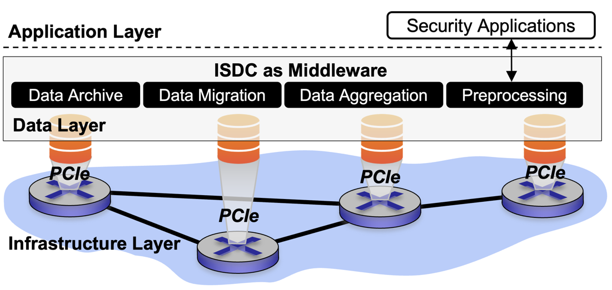

# Enhancing Network Attack Detection with Distributed and In-Network Data Collection System
[USENIX Security '24]

## Introduction
The collection of network data poses a significant challenge for machine/deep learning-driven network defense systems in terms of data avaiability and communication bandwidth. This work proposes a new paradigm, namely In-network Serverless Data Collection (ISDC), to eliminate the bottleneck between network infrastructure (where data is generated) and security application servers (where data is consumed). As shown, ISDC is a middleware that resides in distributed switches' network operating system (NOS), forming a data layer, with the main mission that eliminating the bottleneck between the infrastructure layer and application layer. Interacting with its data plane functions, ISDC is responsible for task allocation and migration for effective and efficient utilization of in-network resources. Meanwhile, ISDC performs serverless data migration and aggregation for data integrity to serve as a reliable and distributed data source for ML/DL-based security applications. 

  

# Repository Overview
This repository includes the following directories: 

* [Hardware/](https://github.com/NIDS-LAB/ISDC/tree/main/Hardware) contains source code for Barefoot Tofino 1 (Wedge 100BF-32X) switch.
* [Simulation/](https://github.com/NIDS-LAB/ISDC/tree/main/Simulation) contains the source code for software (BMV2) switch implementation, along with the necessary code for running P4 simulations using Mininet.
* [ML/](https://github.com/NIDS-LAB/ISDC/tree/main/ML) contains the source code and dataset for training both local and aggregated model using FedAvg algorithm.

